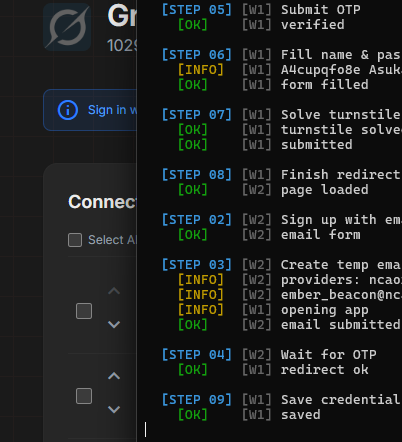

<div align="center">

# WangLinS Auto Sign-Up Grok

### Automated Grok (x.ai) Account Registration + 9Router Integration

**Puppeteer-core · Real Chrome · Turnstile Bypass · OAuth Device Flow**

**Author: WangLinS**

---


<br>



</div>

---

## Fitur

| Fitur | Status |
|-------|--------|
| Auto-register akun Grok (x.ai) | ✅ |
| Temp mail (`@wanglinsaputra/tempmail-wrapper`, 16 provider) | ✅ |
| Auto OTP verification | ✅ |
| Turnstile bypass (Chrome extension) | ✅ |
| SSO cookies save | ✅ |
| 9Router OAuth device flow | ✅ |
| Dashboard UI (progress, logs, stats) | ✅ |
| Batch registration | ✅ |
| Add existing accounts to 9Router | ✅ |

---

## Prasyarat

| Tool | Versi |
|------|-------|
| Node.js | 18+ |
| Google Chrome | Stable |

> `HEADLESS=false` recommended — x.ai often blocks headless Chrome.

---

## Install

```bash
npm install
# butuh Google Chrome system (bukan download Chromium)
# Linux: google-chrome-stable | Windows: set CHROME_PATH
cp .env.example .env
# edit .env (lihat tabel di bawah)
```

---

## Konfigurasi `.env` (untuk user)

Isi yang **wajib / biasa dipakai** orang yang clone repo:

| Key | Wajib? | Contoh | Keterangan |
|-----|--------|--------|------------|
| `PASSWORD` | ✅ | `YourStrongPassword123` | Password akun Grok yang dibuat. **Min 16 char**, huruf+angka |
| `TEMPMAIL_PROVIDER` | ✅ | `ncaori,zoromail` | Provider temp mail. Multi: pisah koma. Proven OK: `ncaori` |
| `SEAL_UNLOCK_URL` | ✅ (signup) | `https://wanglins.6n6.web.id` | API unlock extension Turnstile (sealed) |
| `SEAL_TOKEN` | ✅ (signup) | *(e4k-0Dil5dKU82VlBLzp50AdWmWVPCdc)* | Bearer token unlock. Tanpa ini signup gagal load extension |
| `ROUTER9_URL` | opsional | `http://localhost:20128` | Base URL 9Router. Perlu kalau mau add akun ke 9Router |
| `ROUTER9_PASS` | opsional | `your_password` | Password login 9Router |
| `HEADLESS` | opsional | `false` | `false` = jendela Chrome (recommended). `true` sering kena CF |
| `CHROME_PATH` | opsional | path ke `chrome.exe` / `google-chrome` | Kosong = auto-detect |
| `OUT_FILE` | opsional | `email.txt` | File output akun (default `email.txt`) |

### Contoh `.env` minimal (user)

```ini
PASSWORD=YourStrongPassword123
TEMPMAIL_PROVIDER=ncaori,zoromail
HEADLESS=false

SEAL_UNLOCK_URL=https://wanglins.6n6.web.id
SEAL_TOKEN=seal_token

# Opsional — hanya kalau pakai menu add ke 9Router
ROUTER9_URL=http://localhost:20128
ROUTER9_PASS=your_9router_password
```

Provider list: `mail.tm`, `guerrillamail`, `yopmail`, `dropmail`, `1secemail`, `ncaori`, `zoromail`, dll.  
x.ai memblokir banyak domain disposable — utamakan `ncaori`.

---

## Penggunaan

```bash
npm run dev
```

Menu:

```
1) Create akun Grok (signup)     → tanya berapa akun
2) Add akun ke 9Router           → dari email.txt, tanya berapa terakhir
0) Exit
```

## Flow

1. Buka accounts.x.ai/sign-up  
2. Temp email via `TEMPMAIL_PROVIDER`  
3. OTP poll → verify  
4. Nama + password  
5. Turnstile (extension sealed → unlock via `SEAL_UNLOCK_URL` + `SEAL_TOKEN`)  
6. Submit → grok.com  
7. Save SSO → `email.txt`  
8. Opsional: OAuth device flow → 9Router  

---

## Notes

| Item | Detail |
|------|--------|
| Speed | ±17–20s / akun |
| Chrome | real Google Chrome via `puppeteer-core` (`CHROME_PATH` optional) |
| Headless | set `HEADLESS` in `.env` — prefer `false` |
| Proxy | Jangan — CF block |
| Turnstile | `turnstile/script.sealed` di repo; plain `script.js` tidak di-publish |
| Unlock | butuh net 1x ke `SEAL_UNLOCK_URL` saat start create akun |

---

## License

Proyek ini dilisensikan di bawah **Apache License 2.0**.

Lihat file [`LICENSE`](./LICENSE) untuk teks lengkap.

```
Copyright [yyyy] [name of copyright owner]

Licensed under the Apache License, Version 2.0 (the "License");
you may not use this file except in compliance with the License.
You may obtain a copy of the License at

    http://www.apache.org/licenses/LICENSE-2.0

Unless required by applicable law or agreed to in writing, software
distributed under the License is distributed on an "AS IS" BASIS,
WITHOUT WARRANTIES OR CONDITIONS OF ANY KIND, either express or implied.
See the License for the specific language governing permissions and
limitations under the License.
```

---

## Disclaimer

**Baca sebelum pakai.**

1. **Tujuan edukasi / riset pribadi saja.** Repo ini disediakan sebagai contoh otomasi browser (Puppeteer, flow registrasi, integrasi OAuth). Bukan produk komersial, bukan layanan akun, bukan undangan melanggar aturan pihak ketiga.

2. **Kepatuhan ToS & hukum = tanggung jawabmu.** Otomasi pendaftaran, temp mail, atau bypass challenge (mis. Turnstile) **bisa melanggar** Terms of Service x.ai / Grok, Cloudflare, provider email, atau hukum setempat. Kamu wajib cek dan patuhi aturan yang berlaku di yurisdiksimu. Author **tidak** menyetujui, mendorong, atau menjamin legalitas penggunaan untuk mass-register, jual-beli akun, spam, fraud, atau penyalahgunaan layanan.

3. **Tidak ada jaminan.** Software diberikan **AS IS**, tanpa warranty tersurat maupun tersirat (termasuk merchantability, fitness for a particular purpose, non-infringement) — selaras [Apache License 2.0](./LICENSE) Pasal 7.

4. **Batasan tanggung jawab.** Author / contributor **tidak bertanggung jawab** atas: ban akun, loss data, claim pihak ketiga, denda, tuntutan, kerusakan langsung/tidak langsung, atau konsekuensi lain dari penggunaan, penyalahgunaan, atau ketidakmampuan memakai software ini — selaras [Apache License 2.0](./LICENSE) Pasal 8.

5. **Kredensial & token.** Jangan commit `.env`, password, cookie SSO, atau `SEAL_TOKEN`. Token unlock bersifat pribadi; penyalahgunaan token = tanggung jawab pemegang token.

6. **Pihak ketiga.** Nama/merek x.ai, Grok, Chrome, Cloudflare, 9Router, dll. milik pemiliknya masing-masing. Repo ini **tidak** berafiliasi, disponsori, atau disetujui oleh mereka.

Dengan meng-clone, menginstal, atau menjalankan software ini, kamu menyatakan sudah membaca Disclaimer ini + [`LICENSE`](./LICENSE) dan menanggung sendiri risiko penggunaan.

---

<div align="center">

**WangLinS** · Educational / research use only. See [Disclaimer](#disclaimer) & [LICENSE](./LICENSE).

</div>
